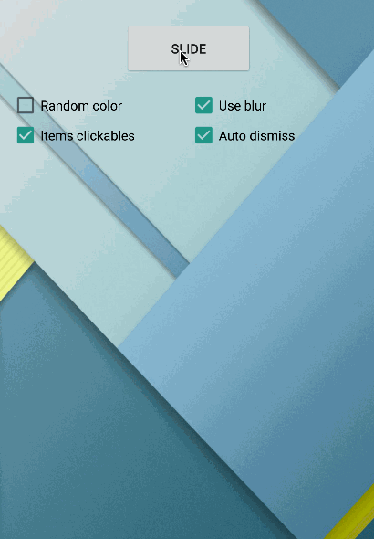

# PickerUI

[](http://android-arsenal.com/details/1/2457) [](https://maven-badges.herokuapp.com/maven-central/com.github.davidpizarro/pickerui)

Android library to display a list of items for pick one with blur effect (if you wish).
Support for Android 3.0 and up. It supports portrait and landscape mode, saving the state.


Try out the sample application on [Google Play][1].

<a href="https://play.google.com/store/apps/details?id=com.dpizarro.libraries.uipickerlibrary">
  
</a>

Demo
=========================



Including in Your Project
=========================

**Last version is 1.0.1**

Just add the following statement in your build.gradle

    compile 'com.github.davidpizarro:pickerui:VERSION'
    
You may also add the library as an Android Library to your project. All the library files live in ```library```.

Usage
=====

To add the PickerUI to your layout add this to your xml
```xml
<com.dpizarro.uipicker.library.picker.PickerUI
        android:id="@+id/picker_ui_view"
        android:layout_width="match_parent"
        android:layout_height="wrap_content"/>
```  

You can add custom attributes in your xml to customize: background, colors, behaviors, elements, blur, blur effects...
```xml

<com.dpizarro.uipicker.library.picker.PickerUI
        android:id="@+id/picker_ui_view"
        android:layout_width="match_parent"
        android:layout_height="wrap_content"
        pickerui:backgroundColor="#4cffa5"
        pickerui:linesCenterColor="#3941ff"
        pickerui:autoDismiss="true"
        pickerui:itemsClickables="true"
        pickerui:entries="@array/months"
        pickerui:textCenterColor="#000000"
        pickerui:textNoCenterColor="#737373"
        pickerui:blur="true"
        pickerui:blur_downScaleFactor="@integer/blur_downscale_min"
        pickerui:blur_FilterColor="#ff5e48"
        pickerui:blur_radius="@integer/blur_radius_min"
        pickerui:blur_use_renderscript="true"/>
        
```
Review [attrs.xml][3] file to know the list of shapes ready to be used in the library.


This configuration can be also provided programmatically. You can use PickerUI programatically, using the Builder class to set the settings and the desired functionalities of panel to make easy:
```java
PickerUI mPickerUI = (PickerUI) findViewById(R.id.picker_ui_view);

List<String> options = Arrays.asList(getResources().getStringArray(R.array.months));

PickerUISettings pickerUISettings = new PickerUISettings.Builder()
                                                      .withItems(options)
                                                      .withBackgroundColor(getRandomColor())
                                                      .withAutoDismiss(true)
                                                      .withItemsClickables(false)
                                                      .withUseBlur(false)
                                                      .build();

mPickerUI.setSettings(pickerUISettings);
```

You can set/get values programatically:
```java
mPickerUI.setItems(this, options);
mPickerUI.setColorTextCenter(R.color.background_picker);
mPickerUI.setColorTextNoCenter(R.color.background_picker);
mPickerUI.setBackgroundColorPanel(R.color.background_picker);
mPickerUI.setLinesColor(R.color.background_picker);
mPickerUI.setItemsClickables(false);
mPickerUI.setAutoDismiss(false);
mPickerUI.isPanelShown();
```

To slide (show/hide) PickerUI, you only have to use **`slide()`** method, selecting none (by default, center) or some position.
```java
mPickerUI.slide();
//or
mPickerUI.slide(8);
```

In order to receive the value selected in the picker, you will need to implement the `onItemClickPickerUI` interface.
```java
mPickerUI.setOnClickItemPickerUIListener(new PickerUI.PickerUIItemClickListener() {
                    @Override
                    public void onItemClickPickerUI(int which, int position, String valueResult) {
                        Toast.makeText(MainActivity.this, valueResult, Toast.LENGTH_SHORT).show();
                    }
                });
```

Or browse the [source code of the sample application][2] for a complete example of use.

Blur effect
=====

This library applies a blur effect when you slide the picker, but it is optional and optimized.
You can choose Java algorithm (slower) or **`RenderScript`** (a quick and efficient solution to blur images). Available since API 11 (Honeycomb), **`RenderScript`** allows to take advantage of the GPU acceleration and is targeted at high-performance 3D rendering and compute operations.

For the integration of the **`RenderScript`** support library you just have to add two lines to your **`build.gradle`**. You do not need to declare any dependencies. Depending on the gradle version you are running, the commands are slightly different:

#### 1. Gradle version 0.14+ and newer
  ```xml
  android {
      defaultConfig {
          renderscriptTargetApi 19
          renderscriptSupportModeEnabled true
      }
  }
  ```

#### 2. Older Gradle versions up to 0.13
  ```xml
  android {
    defaultConfig {
        renderscriptTargetApi 19
        renderscriptSupportMode true
    }
  }
  ```

Contribution
============

#### Pull requests are welcome!

I'd like to improve this library with your help!
If you've fixed a bug or have a feature you've added, just create a pull request. Issues can be reported on the github issue tracker.

Who's using it
=========================
*Does your app use AutoLabelUI? If you want to be featured on this list drop me a line.*

Author
============

David Pizarro (dpizarro89@gmail.com)

<a href="https://plus.google.com/u/0/110797503395500685158">
  
</a>
<a href="https://twitter.com/DavidPizarro89">
  
</a>
<a href="https://www.linkedin.com/in/davidpizarrodejesus">
  
</a>


License
-------

    Copyright 2015 David Pizarro

    Licensed under the Apache License, Version 2.0 (the "License");
    you may not use this file except in compliance with the License.
    You may obtain a copy of the License at

       http://www.apache.org/licenses/LICENSE-2.0

    Unless required by applicable law or agreed to in writing, software
    distributed under the License is distributed on an "AS IS" BASIS,
    WITHOUT WARRANTIES OR CONDITIONS OF ANY KIND, either express or implied.
    See the License for the specific language governing permissions and
    limitations under the License.
---

[1]: https://play.google.com/store/apps/details?id=com.dpizarro.libraries.uipickerlibrary
[2]: https://github.com/DavidPizarro/PickerUI/tree/master/app
[3]: https://github.com/DavidPizarro/PickerUI/blob/master/library/src/main/res/values/attrs.xml
